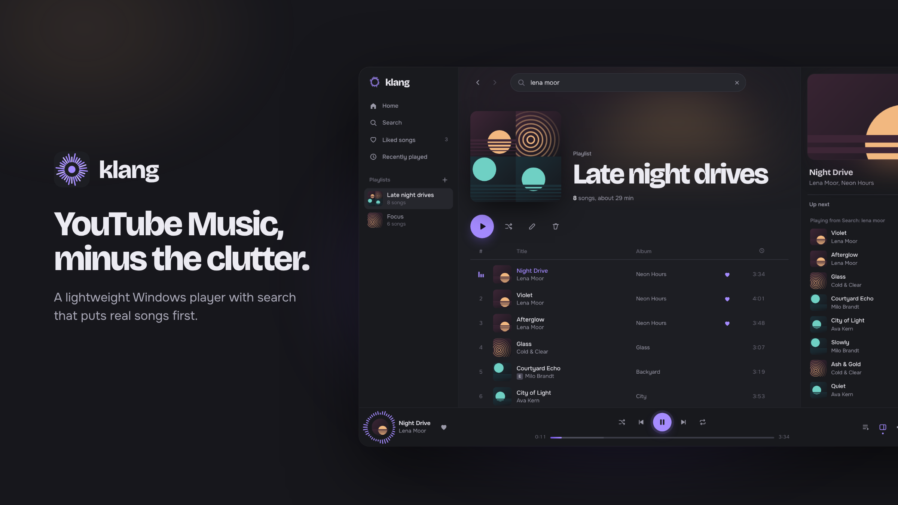
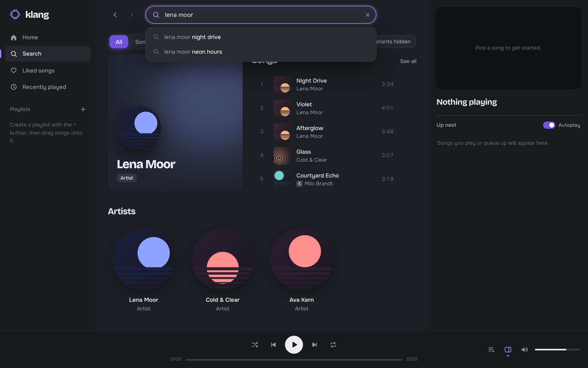
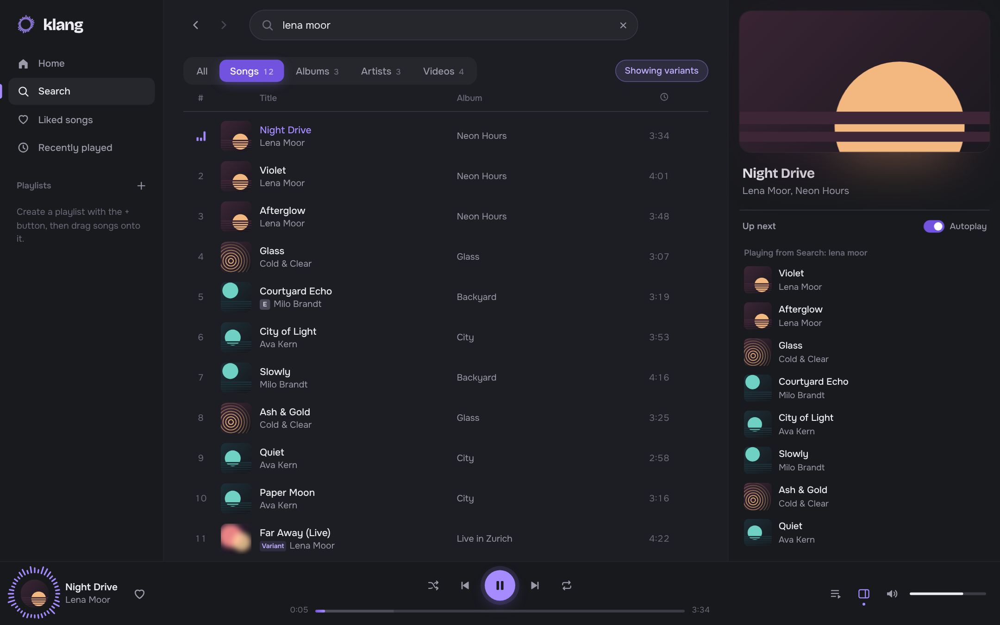
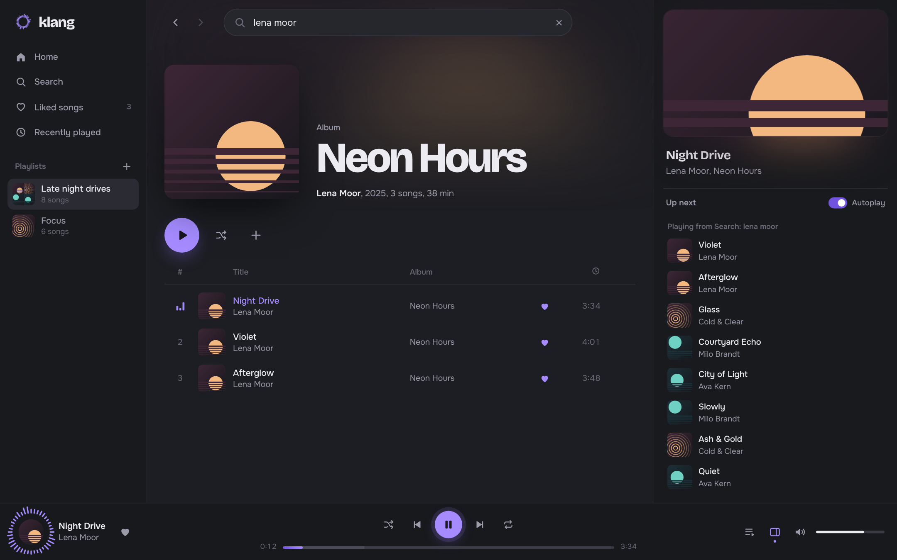
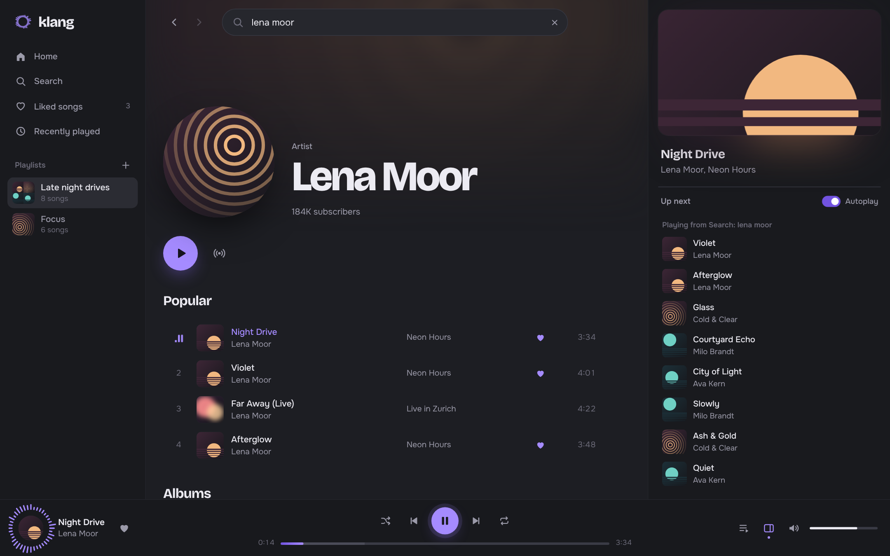
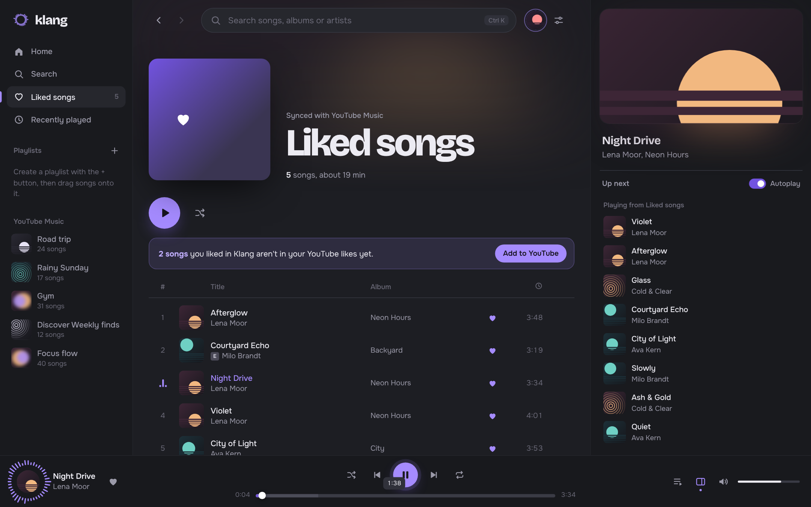
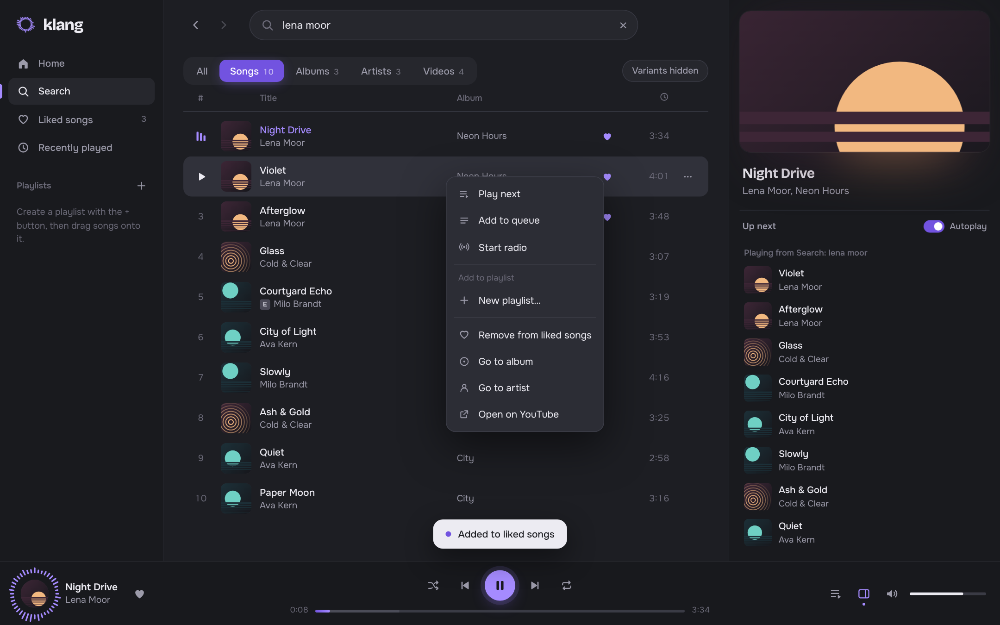
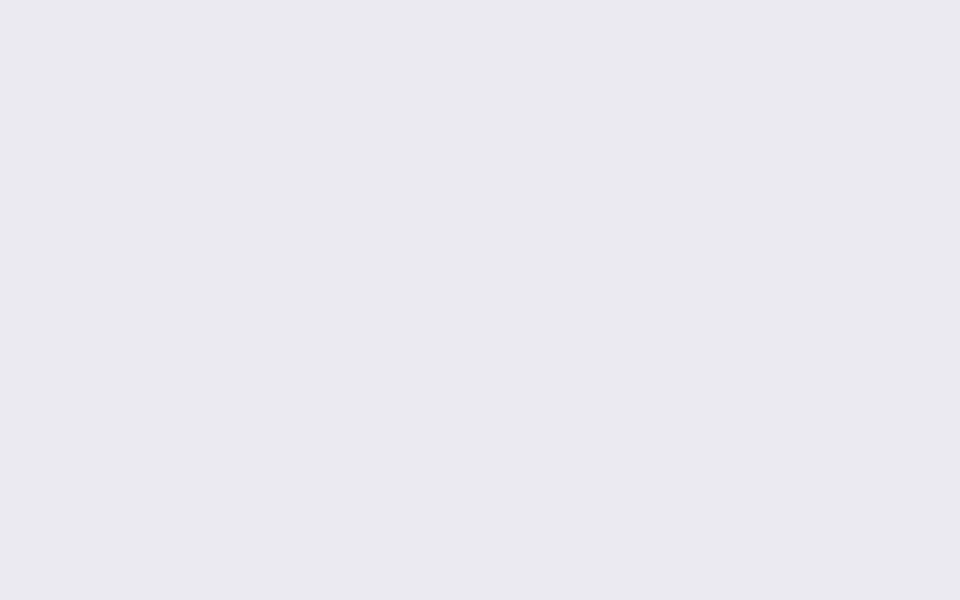

<div align="center">


# Klang

**YouTube Music, minus the clutter.**<br>
A fast, good-looking music player for Windows with a search that actually finds the song you meant.

<p>
  
  
  
  
  
</p>

<a href="https://github.com/HknCore/klang/releases/latest"><b>⬇ Download for Windows</b></a>
&nbsp;·&nbsp;
<a href="#-features">Features</a>
&nbsp;·&nbsp;
<a href="#-questions">Questions</a>

<br><br>



</div>

<br>

## Why Klang?

You know the feeling. You search for a song and get the live version, a cover, a sped-up edit, a lyric video and a fan upload, in that order. The official web player eats memory, stutters, and buries the song under everything else.

Klang fixes the part you touch every day. It keeps the huge YouTube Music catalog, and wraps it in a quick, quiet player that respects your time and your PC.

<br>

<table>
<tr>
<td width="50%" valign="top">


### Search that knows what a song is
Results are split into **Songs**, **Albums**, **Artists** and **Videos**. Duplicates are merged, exact matches rise to the top, and covers, live cuts, remixes, sped-up and nightcore edits stay hidden until you ask for them.

</td>
<td width="50%" valign="top">


### Light on your PC
One .exe, nothing to install. No bundled browser, no Electron: Klang opens a real app window drawn by WebView2, the Edge engine that already comes with Windows.

</td>
</tr>
<tr>
<td width="50%" valign="top">


### Your YouTube Music library, built in
Sign in with YouTube and your playlists and liked songs show up right away. Likes sync both ways. Prefer not to sign in? Klang keeps its own likes and playlists on your computer.

</td>
<td width="50%" valign="top">


### Music that keeps going
When your queue runs out, Klang can continue with similar songs. Start a radio from any track, or line up what plays next with a right-click.

</td>
</tr>
<tr>
<td width="50%" valign="top">


### Made to feel good
Graphite and lavender, its own app window with a matching title bar, smooth transitions, a breathing ring around the cover while music plays, and a short intro that sets the mood. Prefer it calm? Switch animations off in the settings.

</td>
<td width="50%" valign="top">


### Built for the keyboard
<kbd>Ctrl</kbd>+<kbd>K</kbd> to search, <kbd>Space</kbd> to play, <kbd>Ctrl</kbd>+<kbd>→</kbd> to skip. Mouse back and forward buttons work too.

</td>
</tr>
</table>

<br>

## ✦ A closer look

<h3 align="center">Search, sorted</h3>
<p align="center">Type a name and get a clear top result, the real songs, then artists and albums.<br>Suggestions appear as you type.</p>



<br><br>

<h3 align="center">No more “Sped Up (Nightcore Remix)”</h3>
<p align="center">Variants are hidden by default. One click shows them again, clearly labeled.</p>



<br><br>

<h3 align="center">Albums and artists that look the part</h3>
<p align="center">Every page picks up the colors of its cover art.</p>

<table>
<tr>
<td width="50%"></td>
<td width="50%"></td>
</tr>
</table>

<br>

<h3 align="center">Bring your library with you</h3>
<p align="center">Sign in once and your YouTube Music playlists and likes are right there in the sidebar.<br>Songs you liked in Klang before signing in can be added to YouTube with one click.</p>



<br><br>

<h3 align="center">Everything one right-click away</h3>
<p align="center">Play next, add to queue, start a radio, add to a playlist, jump to the album or artist.</p>



<br><br>

<h3 align="center">Now playing, alive</h3>

<p align="center">
  
</p>

<p align="center">The cover turns into a record and a ring of bars dances around it while music plays.</p>

<br>

<h3 align="center">Hello, Klang</h3>

<p align="center">
  
</p>

<br>

## ⬇ Get started in a minute

> **You need:** Windows 10 or 11. Nothing else, no Python, no installer.

<table>
<tr>
<td align="center" width="33%">
<h3>1</h3>
<b>Download</b><br>
Get <a href="https://github.com/HknCore/klang/releases/latest/download/Klang.exe"><code>Klang.exe</code></a><br>from the latest release.
</td>
<td align="center" width="33%">
<h3>2</h3>
<b>Double-click it</b><br>
Put it anywhere you like, for example on your desktop, and start it.
</td>
<td align="center" width="33%">
<h3>3</h3>
<b>Search and play</b><br>
Press <kbd>Ctrl</kbd>+<kbd>K</kbd>, type a song, press <kbd>Enter</kbd>. That's it.
</td>
</tr>
</table>

**Windows says it protected your PC?** Klang isn't code-signed yet, so SmartScreen doesn't know it. Click **More info → Run anyway**. Every build is made in the open by [GitHub Actions](../../actions) from the code in this repository.

**Want it in your taskbar or Start menu?** Right-click `Klang.exe` and choose **Pin to taskbar** or **Pin to Start** (on Windows 11 under **Show more options**).

**New version out?** Download the new `Klang.exe` and replace the old one. Your liked songs and playlists stay where they are.

<details>
<summary><b>Run from source instead</b></summary>
<br>

You need [Python 3.9 or newer](https://www.python.org/downloads/) (`winget install Python.Python.3.12`).

1. Download the repository (**Code → Download ZIP**) and unzip it.
2. Double-click `Klang.bat`. The first start sets things up for about a minute.
3. Optional: `Create shortcut.bat` puts Klang on your desktop, `Update.bat` refreshes the YouTube Music connector.

To build the exe yourself: `pip install pyinstaller`, then `pyinstaller klang.spec`. The result is in `dist/`.
</details>

<br>

## ⌨ Shortcuts

| Do this | Press |
| --- | --- |
| Search from anywhere | <kbd>Ctrl</kbd>+<kbd>K</kbd> or <kbd>/</kbd> |
| Play or pause | <kbd>Space</kbd> |
| Next or previous song | <kbd>Ctrl</kbd>+<kbd>→</kbd> / <kbd>Ctrl</kbd>+<kbd>←</kbd> |
| Jump 5 seconds | <kbd>→</kbd> / <kbd>←</kbd> |
| Like the current song | <kbd>L</kbd> |
| Shuffle on or off | <kbd>S</kbd> |
| Mute | <kbd>M</kbd> |
| Back or forward | <kbd>Alt</kbd>+<kbd>←</kbd> / <kbd>Alt</kbd>+<kbd>→</kbd>, or your mouse side buttons |

<br>

## ? Questions

<details>
<summary><b>Do I need a YouTube or Google account?</b></summary>
<br>
No. Search and playback work without signing in, and Klang keeps its own likes and playlists on your computer. Signing in adds your YouTube Music playlists and likes.
</details>

<details>
<summary><b>How does signing in work? Is it safe?</b></summary>
<br>
Click <b>Sign in with YouTube</b> in the sidebar. Google's own sign-in page opens in a Klang window, so Klang never sees your password. After you sign in, Klang keeps the YouTube session on your computer, the same way a browser does:

- **Encrypted.** The session is stored in <code>%APPDATA%\Klang</code>, encrypted with Windows' own data protection (DPAPI). Only your Windows user account can read it, just like your browser's cookies.
- **Never sent anywhere else.** It only goes to YouTube Music. Klang has no servers of its own.
- **Locked to Klang's window.** Klang's background service only accepts commands from its own window. Websites open in your browser can't talk to it.

Keep in mind that a signed-in session lets whoever has it use YouTube as you, so treat your PC like you would a browser you're signed in to. <b>Sign out</b> in the account menu removes the session from your computer. To end it on Google's side as well, go to your <a href="https://myaccount.google.com/device-activity">Google account → Your devices</a>.
<br><br>
If Google says the browser or app may not be secure, choose <b>Use another way</b>: Klang walks you through copying the sign-in from your regular browser. Only ever paste that into Klang itself, never into a website or a message, and never because someone asks you to.
<br><br>
Klang uses YouTube Music's unofficial interface, like other community players. That's not officially supported by Google.
</details>

<details>
<summary><b>Are there ads?</b></summary>
<br>
Klang plays music through YouTube's official embedded player, so YouTube decides about ads, just like on youtube.com. If you signed in through the Klang window with a Premium account, the player knows you too.
</details>

<details>
<summary><b>Why does Klang sometimes skip a song?</b></summary>
<br>
Some labels don't allow their uploads to play outside of YouTube. When that happens, Klang quietly looks for another official upload of the same song with the same length and plays that instead. If there isn't one, it moves on to the next song and tells you.
</details>

<details>
<summary><b>Can I import my Spotify playlists?</b></summary>
<br>
Not yet. It's the next big thing on the list (see below).
</details>

<details>
<summary><b>Where is my data stored?</b></summary>
<br>
In <code>%APPDATA%\Klang\library.json</code> (paste that into the Explorer address bar). Back it up or copy it to another PC to take your library with you. When running from source, it lives in <code>data/</code> next to <code>Klang.bat</code>.
</details>

<details>
<summary><b>Can I try it without internet?</b></summary>
<br>
Yes. Run <code>Klang.exe --mock</code> (or <code>python server.py --mock</code>) to open a demo with sample music. That's how the screenshots on this page were made.
</details>

<br>

## 🔒 Private by design


Klang only listens on your own computer (`127.0.0.1`), never on your network, and only answers its own window: every start creates a new secret that other websites can't see. It collects nothing and phones home to no one. If you sign in, your YouTube session is stored encrypted with Windows' own data protection. The only outside connections are to YouTube Music, to fetch search results, play music and, if you signed in, read and update your library. When you close the window, Klang shuts itself down.

<br clear="left">

<br>

## 🗺 What's next

- [ ] Import playlists from Spotify
- [x] Sign in to see your YouTube Music library and playlists
- [ ] Mini player that stays on top
- [ ] Tray icon and media keys when the window is in the background
- [x] One .exe, no Python needed
- [ ] Code-signed builds, so Windows stops warning on first start

Ideas and bug reports are welcome in the issues.

<br>

## 🛠 How it works

```
 Klang.exe ──▶ server.py (local helper, 127.0.0.1:8777)
                  │  cleans up search results via ytmusicapi
                  │  stores likes and playlists in %APPDATA%\Klang
                  ▼
              app window (WebView2) ──▶ ui/  (plain HTML, CSS, JavaScript)
                                   └─ plays through the official YouTube embed
```

No frameworks. The interface is three files in `ui/`, the helper is a single Python file, and `klang.spec` packs both into `Klang.exe`. Every push is built and smoke-tested on Windows by GitHub Actions; publishing a release attaches the exe automatically. Run `python server.py --no-window` to start just the helper and open `http://127.0.0.1:8777` in any browser.

<br>

## 💜 Credits

- [ytmusicapi](https://github.com/sigma67/ytmusicapi) for talking to YouTube Music
- [Bricolage Grotesque](https://github.com/ateliertriay/bricolage) and [Onest](https://github.com/simpals/onest) typefaces, under the SIL Open Font License

Klang is an independent project and is not affiliated with, endorsed by or connected to YouTube or Google. YouTube and YouTube Music are trademarks of Google LLC.

Released under the [MIT License](LICENSE).

<div align="center">
<br>

<br>
<sub><i>klang</i> is German for “sound”.</sub>
</div>
